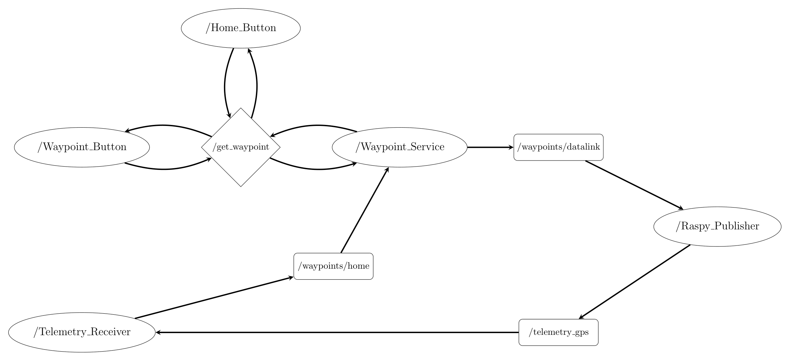

# Ros_Paparazzi

`ros_paparazzi` is a ROS 2 package that includes the functionalities to communicate with the Paparazzi autopilot system.

## Repository Structure

This repository contains two packages:

- **ros_paparazzi_core**: Contains the main Python nodes responsible for subscribing and publishing data to/from the Paparazzi autopilot system.
- **ros_paparazzi_interfaces**: Defines the custom ROS 2 message and service types used by `ros_paparazzi_core`.

## Requirements

- ROS 2 Humble
- A Raspberry with a SSH configured


## Setup Instructions

Clone the repository into your ROS 2 workspace:

```bash
cd {ROS_WORKSPACE}/src
git clone {REPOSITORY}
```

For an easy install, a `./install.sh` is included (you can also use colcon to build the package).


## Running the Nodes

At the moment there are four nodes:
- **Raspy_Publisher**: Manage the serial communication with the AP
- **Waypoint_Service**: Send the waypoint to the raspberry
- **Telemetry_Receiver**: Receive the telemetry info (currently position and IMU)
- **X_Button**: Multiple Nodes to respond to the buttons of the UI



In your computer, launch the UI with
```
ros2 run ros_paparazzi_core bokeh_serve
```

For launching the node in the raspberry, a script `launch_ros_node.sh` is provided.

<!--  
Launch files are provided to make running the nodes easier.
Use `main_launch.py` for launching the nodes that will run indefinitely

```
ros2 launch ros_paparazzi_core main_launch.py
```

Use `send_launch.py` to send a waypoint to the autopilot

```
ros2 launch ros_paparazzi_core send_launch.py
``` -->

<!-- TODO: Add the ROS argument instructions -->


## The UI

Currently, there are two working buttons
- The Send Waypoint button will send the waypoint coordinates indicated above itself.
- The Request HOME will reset the coordinates origin
- The Connect Raspberry will launch the node in the Raspberry (not working)


